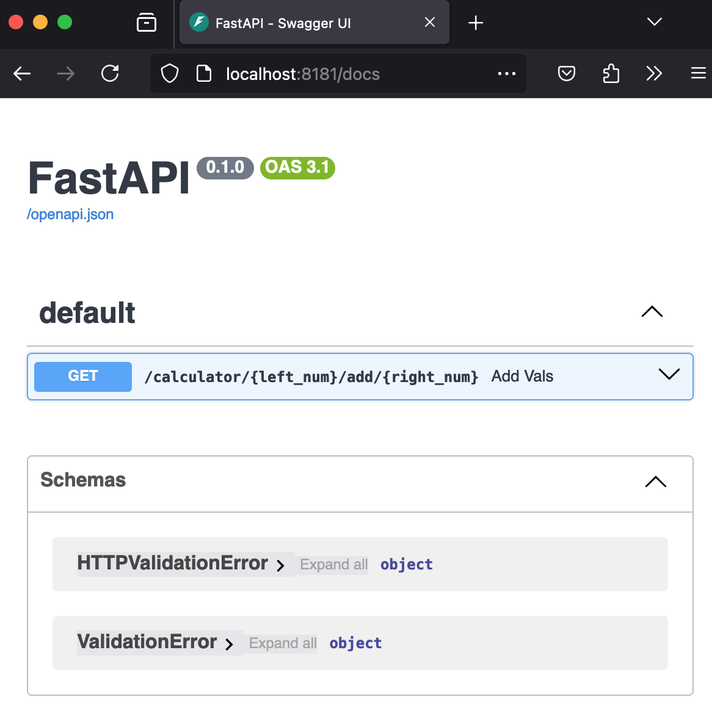

# FastAPI adder demo

A demo JSON API app based on FastAPI.
Includes `make`-target helpers to make development and containerization easier.

No CI or CD yet.


## Running

Prerequisites: we assume that `docker` and `make` are installed.

Build the image and run the container,
you will see the app responding at port 8181 on your local machine

```bash
make build-image
make run-in-container
```

if you point a browser at [http://localhost:8181/docs](http://localhost:8181/docs) you will see OpenAPI docs




## Development

Prerequisites: you will need to have python and the [poetry python packaging and dependency management tool](https://python-poetry.org/docs/) installed;
in addition to the "Running" prerequisites above.

You can use `make install-local` and `make run-local-dev` to get the service running on your local machine.

Before running unit tests and static analysis we need to `make install-dev`
in order to get non-production dependencies.

After that, `make test` and `make lint` will run the tests and linting respectively.
